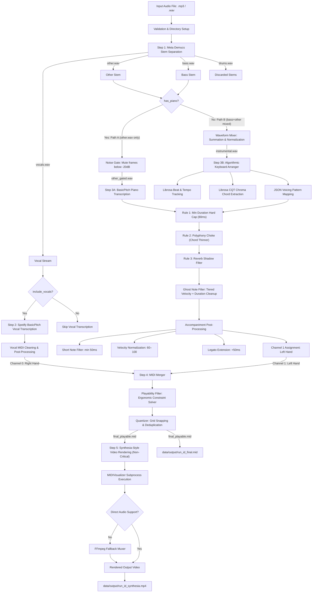

# PIPELINE WORKFLOW & IMPLEMENTATION STATUS
## AI-Powered Audio-to-Piano-Synthesia Pipeline

This document provides a comprehensive, non-code technical breakdown of the **Project Piano** audio-to-piano pipeline. It details the step-by-step operational flow, the underlying algorithms, the specific technology stack utilized for each module, and the musical reasoning behind the processing steps.

---

## 1. High-Level Pipeline Architecture

The pipeline is designed as a highly modular, configurable system. It processes a raw audio file (such as a `.wav` or `.mp3` recording of a song) through advanced neural audio source separation, vocal and piano transcription, rhythmic beat/tempo tracking, chord detection, algorithmic keyboard arrangement, ergonomic playability filtering, and dynamic video synthesis.

### Modular System Flow

---

## 2. Core Technology Stack Matrix

The following table summarizes the technology stack used across the pipeline and the specific responsibility of each dependency:

| Pipeline Step | Library / Technology | Version (Min) | Operational Role & Purpose |
| :--- | :--- | :--- | :--- |
| **Separation** | `demucs` | `4.0.0` | Meta's Hybrid Transformer Demucs model (`htdemucs`) for high-fidelity audio source separation. |
| **Separation** | `torchcodec` | `0.13.0` | High-efficiency audio decoding and tensor saving for virtual environment execution. |
| **Vocal MIDI** | `onnxruntime` | `1.16.0` | Executes Spotify's `basic-pitch` neural networks via ONNX for Windows compatibility. |
| **Piano MIDI** | `basic-pitch` (via `onnxruntime`) | `0.3.0` | Spotify's modern polyphonic piano transcription model, configured for the full piano range (A0–C8). |
| **Audio Analysis**| `librosa` | `0.10.0` | Audio loading, sample rate management, Constant-Q Transform (CQT) chroma computation, and tempo tracking. |
| **Audio I/O** | `soundfile` | `0.12.0` | Reads and writes wave files, summing and normalizing audio waveforms. |
| **MIDI Math** | `pretty_midi` | `0.2.10` | Object-oriented parsing, manipulation, editing, and writing of MIDI tracks, notes, and control changes. |
| **Math Engine** | `numpy` & `scipy` | `1.24.0` | Linear algebra, cosine similarity computations, grid rounding, and signal pad operations. |
| **Orchestration**| `pydantic` & `pyyaml` | `2.0` / `6.0` | Strictly typed runtime configuration management and YAML file parsing. |
| **Diagnostics** | `loguru` | `0.7.0` | Comprehensive logging, console tracing, and run-specific error reporting. |
| **Rendering** | `MIDIVisualizer` | *Latest* | Standalone compiled C++ command-line tool for ultra-smooth falling-notes rendering. |
| **Rendering** | `FFmpeg` | `4.4` | System-level binary used to mux high-quality audio tracks back onto rendered video streams. |

---

## 3. Dynamic Control Flow Matrix

The pipeline dynamically shifts its execution graph based on two boolean parameters: `include_vocals` (whether to extract and transcribe the singer's melody) and `has_piano` (whether to transcribe an existing piano or synthesize an accompaniment from scratch).

| `include_vocals` | `has_piano` | Right Hand (Channel 0) | Left Hand (Channel 1) | Core Operations Executed |
| :---: | :---: | :--- | :--- | :--- |
| **`True`** | **`True`** | Neural Vocal Transcription | Neural Piano Transcription | Separation → Vocal Transc. → Piano Transc. → Merging → Filtering → Rendering |
| **`True`** | **`False`** | Neural Vocal Transcription | Algorithmic Chord Arranger | Separation → Vocal Transc. → Algo Arrangement → Merging → Filtering → Rendering |
| **`False`** | **`True`** | *Unused* | Neural Piano Transcription | Separation → Piano Transc. → Channel Assignment → Filtering → Rendering |
| **`False`** | **`False`** | *Unused* | Algorithmic Chord Arranger | Separation → Algo Arrangement → Channel Assignment → Filtering → Rendering |

---

## 4. Step-by-Step Pipeline Workflow

### Step 1: Audio Pre-processing & Stem Separation
* **Primary Technology**: Meta's `demucs` (HTDemucs architecture), `torch`, `torchaudio`, and `soundfile`
* **Workflow & Execution**:
  1. **Validation**: The orchestrator receives the target audio file, validates its existence and integrity, and assigns a unique `run_id`.
  2. **Stem Decomposition**: The system loads Meta’s four-stem Hybrid Transformer Demucs model (`htdemucs`). This neural network analyzes the stereo frequency spectra and separates the mixed master audio track into four discrete, high-quality `.wav` audio files: `vocals.wav`, `bass.wav`, `drums.wav`, and `other.wav`.
  3. **Routing Decision**: The drums are discarded. The remaining stems (`bass.wav` and `other.wav`) are **not always mixed**. Instead, the pipeline forks based on the `has_piano` flag — see Step 3 for how each path uses these stems differently.

> [!NOTE]
> Separating the vocals from the instrumentation first prevents the vocal frequencies from interfering with the chord detection and piano transcription algorithms downstream.

> [!IMPORTANT]
> **Bass Stem Routing**: The `bass.wav` stem is deliberately **excluded** from Path A (piano transcription). Bass guitar vibrato, fret slides, and intonation imperfections occupy the same frequency range (C1–C3) as the piano's left hand. Feeding bass into the piano transcriber causes the AI to hallucinate muddy, dissonant notes. The bass is only mixed in for Path B, where the chord detector needs it to identify harmonic roots.

---

### Step 2: Vocal Transcription (Right Hand Melody)
* **Primary Technology**: Spotify's `basic-pitch` (leveraging `onnxruntime`), `pretty_midi`
* **Condition**: Triggered only if `include_vocals` is enabled.
* **Workflow & Execution**:
  1. **ONNX Inference**: The pipeline passes the isolated `vocals.wav` stem into the BasicPitch model. For Windows compatibility on Python 3.12, this runs inside the high-performance `onnxruntime` engine, generating raw MIDI events.
  2. **Pitch Bend Stripping**: Singers naturally employ continuous pitch slides and vibrato. On a mechanical piano, these represent hundreds of microtonal pitch wheel shifts. The transcriber strips all pitch bends in-place, yielding clear, solid notes.
  3. **Range Clamping**: The transcription is clamped to standard vocal frequencies (MIDI pitch 43 to 84, roughly E2 to C#6). This filters out deep sub-bass hums or high-frequency breaths that the model occasionally mistakes for notes.
  4. **Duration Filtering**: Brief notes shorter than a configured duration (e.g., 58ms) are discarded to clean up transients from consonants (like "t" or "k") and breathing patterns.
  5. **Melody Allocation**: The cleaned notes are assigned to MIDI **Channel 0** (internally tagged as the **Right Hand** melody) using the Acoustic Grand Piano instrument configuration.

---

### Step 3: Accompaniment Generation (Left Hand Harmony)
This phase forks into two distinct processing paths based on the `has_piano` config parameter.

#### Path 3A: Neural Piano Transcription (`has_piano == True`)
* **Primary Technology**: Spotify's `basic-pitch` (via `onnxruntime`), `librosa`, `soundfile`
* **Audio Input**: `other.wav` only (bass excluded) → noise-gated → `other_gated.wav`
* **Workflow & Execution**:
  1. **Pre-Transcription Noise Gate**: Before any AI inference, the `other.wav` stem is passed through a hard noise gate. The gate computes per-frame RMS energy, converts to dB, and mutes any frame below the configured threshold (default: **-20 dB**) to digital silence. This eliminates reverb tails, room noise, and stem bleed that would otherwise cause the AI to hallucinate phantom notes. The gated output is written as `other_gated.wav`.
  2. **ONNX Inference**: The pipeline passes the noise-gated audio into the BasicPitch model — the same modern neural network used for vocal transcription — but configured for the full piano frequency range (A0 at 27.5 Hz to C8 at 4186 Hz). This produces significantly cleaner onset timings and more accurate polyphonic pitch detection.
  3. **Polyphonic Transcription**: BasicPitch extracts polyphonic piano notes with precise onset/offset timings and velocity dynamics. Notes shorter than 50ms are filtered out during inference to eliminate micro-transients from harmonics.
  4. **Ghost Note Cleanup**: A compound velocity + duration filter is applied to the raw MIDI output:
     * *Tier 1 — "Absolute Garbage"*: Notes with velocity < 25 are always deleted (overtone/noise floor artifacts).
     * *Tier 2 — "Reverb Blip"*: Notes with velocity < 45 AND duration < 150ms are deleted (hallucinated reverb echoes).
     * *Tier 3 — Keep*: All remaining notes survive. A soft note (velocity 35) held for 2 seconds is a legitimate fading chord and is preserved.
  5. **Output Generation**: The cleaned MIDI output is validated to ensure notes exist and is assigned to MIDI **Channel 1** (representing the **Left Hand** accompaniment).

#### Path 3B: Algorithmic Keyboard Arrangement (`has_piano == False`)
* **Primary Technology**: `librosa`, `numpy`, `scipy`, `soundfile`
* **Audio Input**: `bass.wav` + `other.wav` → mixed into `instrumental.wav`
* **Workflow & Execution**:
  0. **Stem Mixing**: Unlike Path A, Path B **requires** the bass stem. The `bass.wav` and `other.wav` stems are summed and normalized into a single `instrumental.wav` file. The bass guitar provides the harmonic root information that the chord detector needs to distinguish, e.g., C Major from A minor.
  1. **Tempo and Beat Grid Tracking**: Librosa's onset envelope spectral flux analyzer calculates the global tempo in Beats Per Minute (BPM) and maps every beat's exact timestamp in seconds. The arranger divides the timeline into bars using an estimated downbeat grid (e.g., every 4 beats for 4/4 time).
  2. **Constant-Q Transform (CQT) Chroma Extraction**: The `instrumental.wav` file is analyzed via Constant-Q Transform. This folds the audio spectrum into a 12-semitone chroma vector representing the intensity of the 12 chromatic pitches (C, C#, D... B) present in the music at any moment.
  3. **Beat-Synchronous Smoothing**: Chroma vectors are averaged within each detected beat boundary to smooth out transients and establish steady, beat-aligned harmonic states.
  4. **Cosine Similarity Template Matching**: Each beat's smoothed chroma vector is compared against a comprehensive template dictionary of chord qualities:
     * *Supported chords*: Major, Minor, Diminished, Augmented, Dominant 7th, Major 7th, Minor 7th, sus2, and sus4.
     * The algorithm circularly rolls the chroma vector across all 12 potential roots. It computes the cosine similarity between the vector and the chord templates. The highest similarity score determines the chord (e.g., "A minor").
  5. **Chord Consolidation**: Adjacent beats with identical chord classifications are merged to form musical chord spans.
  6. **Voicing Pattern Synthesis**: The arranger reads rhythmic blueprints from a JSON Pattern Library (e.g., `pop_ballad.json` or `arpeggiated.json`). For each bar, it retrieves the active chord and maps it onto the pattern:
     * *`root` note events* are placed in the deep bass register (transposed down).
     * *`triad` events* lay down full harmonic chord stack structures.
     * *`fifth` / `octave` events* fill in syncopated rhythmic pulses.
  7. **Accompaniment Allocation**: The resulting notes are written to MIDI **Channel 1** (the **Left Hand** track).

---

### Step 4: Accompaniment Post-Processing, Merging, Playability Filtering, & Quantization
* **Primary Technology**: `pretty_midi`, `numpy`
* **Workflow & Execution**:

  #### Phase A: Accompaniment MIDI Post-Processing
  Before merging, the raw accompaniment MIDI (from either Path 3A or 3B) undergoes several quality-improvement passes. The first three steps are **strict ghost note pruning rules** that surgically eliminate AI-hallucinated stray piano sounds (micro-transients, overtone-stuffed chords, and reverb echo ghosts):

  1. **Rule 1 — Minimum Duration Hard Cap**: Sweep the entire MIDI. Any note with duration less than **80ms** (`note.end - note.start < 0.08`) is deleted instantly, regardless of velocity. A real human pressing a piano key intentionally will almost never hold a note for less than 80 milliseconds, even when playing very fast. If it's that short, it's an AI hallucination or an audio glitch.
  2. **Rule 2 — Polyphony Choke (Chord Thinner)**: At every time instant, if more than **4 notes** sound simultaneously on the accompaniment channel, the chord is "choked." The algorithm keeps the **lowest note** (bass root) and the **highest note** (harmony top), then sorts all inner notes by velocity. The quietest inner notes are deleted until only 4 notes remain. This eliminates the extra phantom notes the AI hallucinates inside complex chords due to overtone confusion.
  3. **Rule 3 — Reverb Shadow Filter**: For each quiet note (velocity **< 45**), the algorithm looks backward in time up to **200ms**. If a loud note (velocity **> 70**) ended within that window, the quiet note lives in the "reverb shadow" of the loud chord — the AI is hearing the echo bouncing off the walls of the recording studio. The quiet note is deleted.
  4. **Compound Ghost Note Filter**: The tiered velocity + duration filter (described in Step 3A) is applied as an additional safety net to remove any remaining AI hallucinations while preserving legitimate soft chords.
  5. **Short Note Filter**: Notes shorter than 50ms are discarded to eliminate any micro-transients and harmonic artifacts that survived the ghost note filters.
  6. **Velocity Normalization**: All surviving note velocities are linearly compressed and rescaled to the range **60–100**. This prevents jarring dynamic swings in the final output and creates a smooth, consistent listening experience.
  7. **Legato Extension**: Each note's end time is extended by **50ms** to create a natural sustain/overlap effect, preventing the output from sounding staccato and mechanical.
  8. **Channel & Instrument Assignment**: The cleaned notes are assigned to MIDI **Channel 1** (Left Hand) with the Acoustic Grand Piano instrument (program 0).

  > [!IMPORTANT]
  > **Ordering: Pruning → Normalization.** The three strict ghost note pruning rules (Rules 1–3) run **before** velocity normalization. This is critical — velocity normalization compresses all velocities into the 60–100 range, which would destroy the velocity information that Rule 2 (choke by velocity) and Rule 3 (shadow by velocity threshold) depend on. The raw, unmodified velocities from the AI transcriber must be available for pruning decisions.

  #### Phase B: Merging & Constraint Filtering
  1. **MIDI Merging**: If vocals are present, the vocal MIDI (Channel 0, Right Hand) and the post-processed accompaniment MIDI (Channel 1, Left Hand) are merged into a single multi-channel file. If vocals are disabled, only the accompaniment is passed through.
  2. **Ergonomic Playability Constraints**: Real humans have mechanical limits (e.g., ten fingers, maximum stretch). To make the MIDI physically playable on a real keyboard, the pipeline applies a **Time-Slice Event Sweep** *before* quantization (so pruning decisions are based on the original, unsnapped timings):
     * The notes are converted into chronological ON/OFF events. The solver sweeps from the beginning to the end of the song, examining all sounding pitches at every point in time.
     * **Hand Span Filtering**: If the distance between the lowest and highest simultaneous note on a single hand exceeds the human hand span limit (e.g., 15 semitones / 1.2 octaves), the filter prunes the inner notes. It calculates the median pitch of the chord and deletes notes closest to that median, leaving the critical low bass note and high melody note intact.
     * **Polyphony Limit Filtering**: If the number of sounding notes on one hand exceeds the physical finger count limit (e.g., 4 simultaneous notes), the filter drops the excess. It determines the interval of each note relative to the bass root and prunes notes based on a harmonic priority queue: Perfect 5ths are dropped first (as they add thick, redundant weight), followed by Major 3rds, then Minor 3rds.
  3. **Rhythmic Quantization**: Note start and end times are snapped to a strict musical grid (configured as 16th notes or 32nd notes relative to the tracked tempo). Snapping ensures visual alignments in the final video.
  4. **Timing Cleanup & Deduplication**: If multiple notes of the same pitch collapse to the same start/end time after quantization, they are merged. Notes that overlap are stitched together, and notes with zero duration are expanded to a minimum of one grid unit.
  5. **Output Delivery**: The normalized, human-playable, and quantized file is saved as the master MIDI artifact in `data/output`.

> [!IMPORTANT]
> **Ordering: Playability → Quantization.** The playability filter runs *before* rhythmic quantization. This is deliberate — pruning decisions need accurate, unsnapped onset/offset timings to correctly identify which notes truly overlap in time. If quantization ran first, grid-snapping could artificially collapse or separate notes, causing the playability filter to make incorrect keep/prune decisions.

---

### Step 5: Synthesia-Style Video Rendering *(Non-Critical)*
* **Primary Technology**: `MIDIVisualizer` CLI binary, `ffmpeg`
* **Workflow & Execution**:
  1. **Binary Verification**: The pipeline validates the presence of the standalone compiled `MIDIVisualizer` C++ application, verifying its path.
  2. **Synthesia Visual Rendering**: The final playable MIDI file is passed to the visualizer as a background subprocess with a **600-second timeout**. The tool renders a stunning, high-definition (1920x1080), 60 FPS video of colored blocks falling onto an interactive piano keyboard, customized with a harmonious dark charcoal theme.
  3. **Audio-Video Synchronization (Muxing)**:
     * *Primary Method*: The system attempts to feed the original audio directly into the visualizer using the `--audio` flag so it encodes the audio track in a single pass.
     * *Fallback Muxing*: If the local version of `MIDIVisualizer` does not support direct audio embedding, the pipeline renders a silent MP4 to a temporary `.noaudio.mp4` file. It then invokes `FFmpeg` in a secondary subprocess to copy the visual stream while encoding and muxing the original high-quality audio file (as AAC) back onto the video track. The temporary silent file is deleted after successful muxing.
  4. **Final Export**: The output is validated to ensure non-zero file sizes and saved directly to `data/output` as a shareable Synthesia video file, synced perfectly to the milliseconds of the music.

> [!NOTE]
> **Graceful Degradation**: Video rendering is treated as a *non-critical* step. If the MIDIVisualizer binary is missing, the subprocess times out, or any rendering error occurs, the pipeline **does not fail**. It logs a warning, sets the video output path to empty, and returns a successful `PipelineResult` containing the final playable MIDI. This ensures users always get their MIDI artifact even on systems without MIDIVisualizer or FFmpeg installed.

---

## 5. Summary of Key Algorithmic and Musical Decisions

* **Bass Stem Exclusion (Path A)**: The bass guitar occupies the same frequency range (C1–C3) as the piano's left hand. Bass vibrato, fret slides, and intonation imperfections cause the AI to hallucinate muddy, dissonant MIDI notes. Removing `bass.wav` from Path A and feeding only `other.wav` to the transcriber eliminates this interference. The piano in `other.wav` already contains the pianist's own left-hand low notes.
* **Bass Stem Inclusion (Path B)**: The chord detector *requires* the bass to correctly identify harmonic roots. Without bass, the algorithm cannot distinguish between, e.g., C Major and A minor. Path B deliberately mixes `bass.wav + other.wav` before chord analysis.
* **Pre-Transcription Noise Gate**: A hard amplitude gate mutes frames below -20 dB before the audio reaches the neural transcriber. This kills reverb tails, room noise, and stem bleed that the AI would otherwise interpret as additional notes.
* **Strict Ghost Note Pruning (3 Rules)**: Three surgical rules eliminate AI micro-transients: (1) **Minimum Duration Hard Cap** — notes under 80ms are always deleted as AI blips; (2) **Polyphony Choke** — overstuffed chords are thinned by keeping outer notes (bass root + harmony top) and removing the quietest inner notes; (3) **Reverb Shadow Filter** — quiet notes (vel < 45) appearing within 200ms of a loud note (vel > 70) are deleted as reverb echoes.
* **Compound Ghost Note Filter**: Rather than a flat velocity cutoff, a tiered approach preserves legitimate soft chords while aggressively removing AI hallucinations: velocity < 25 = always delete; velocity < 45 AND duration < 150ms = delete (reverb blip); everything else = keep.
* **Vocal Vibrato Removal**: Stripping pitch bends prevents synthesized pianos from sounding out-of-tune or "wobbly" when mimicking vocal contours.
* **Ergonomic Pruning (Bass & Melody Protection)**: When pruning notes for hand span or polyphony constraints, the algorithm *never* deletes the highest note (retains melody definition) or the lowest note (retains the harmonic foundation).
* **Harmonic Pruning Priority**: Perfect 5ths are pruned before 3rds because the 3rd defines whether a chord is major or minor (crucial for emotional flavor), whereas the 5th is harmonically redundant and can be omitted without changing the chord quality.
* **ONNX Execution on Windows**: Utilizing ONNX runtime for Spotify's BasicPitch allows the pipeline to bypass complex Tensorflow setup issues and run extremely fast on standard consumer laptops.
* **FFmpeg Audio Copier**: Muxing the original audio back onto the video ensures the user hears the rich production value of the original song, while viewing their simplified, playable piano arrangements.
